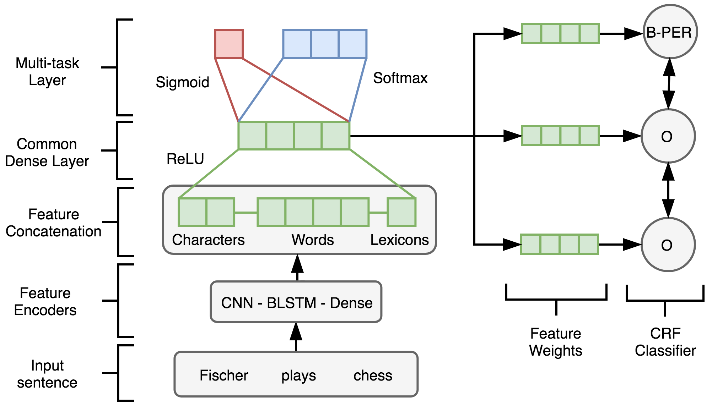

# A Multi-task Approach for Named Entity Recognition on Social Media Data 

This repository shows the implementation of the system described in the paper 
[A Multi-task Approach for Named Entity Recognition on Social Media Data](http://noisy-text.github.io/2017/pdf/WNUT19.pdf).
This system achieved the first place on the 
[3rd Workshop on User-generated Text (W-NUT)](http://noisy-text.github.io/2017/) 
at the [EMNLP 2017](http://emnlp2017.net/) conference.

## System Overview

The system uses a Multi-task Neural Network as a feature extractor. The network is composed of 
a B-LSTM, CNN and a dense representation. When the network is trained, we transfer the learning 
to a Conditional Random Fields (CRF) classifier, which we use to make the final prediction. More 
information can be found in the paper.  



```
____________________________________________________________________________________________________
Layer (type)                     Output Shape          Param #     Connected to                     
====================================================================================================
char_ortho_input (InputLayer)    (None, 20)            0                                            
____________________________________________________________________________________________________
char_ortho_embed (Embedding)     (None, 20, 30)        150         char_ortho_input[0][0]           
____________________________________________________________________________________________________
word_twitter_input (InputLayer)  (None, 3)             0                                            
____________________________________________________________________________________________________
word_postag_input (InputLayer)   (None, 3)             0                                            
____________________________________________________________________________________________________
char_ortho_embed_dropout (Dropou (None, 20, 30)        0           char_ortho_embed[0][0]           
____________________________________________________________________________________________________
word_twitter_embed (Embedding)   (None, 3, 400)        5006800     word_twitter_input[0][0]         
____________________________________________________________________________________________________
word_postag_embed (Embedding)    (None, 3, 100)        10100       word_postag_input[0][0]          
____________________________________________________________________________________________________
gazetteers_input (InputLayer)    (None, 3)             0                                            
____________________________________________________________________________________________________
conv1d_1 (Conv1D)                (None, 18, 64)        5824        char_ortho_embed_dropout[0][0]   
____________________________________________________________________________________________________
word_twitter_embed_dropout (Drop (None, 3, 400)        0           word_twitter_embed[0][0]         
____________________________________________________________________________________________________
word_postag_embed_dropout (Dropo (None, 3, 100)        0           word_postag_embed[0][0]          
____________________________________________________________________________________________________
gazetteers_embed (Embedding)     (None, 3, 6)          115980      gazetteers_input[0][0]           
____________________________________________________________________________________________________
conv1d_2 (Conv1D)                (None, 16, 64)        12352       conv1d_1[0][0]                   
____________________________________________________________________________________________________
concatenate_1 (Concatenate)      (None, 3, 500)        0           word_twitter_embed_dropout[0][0] 
                                                                   word_postag_embed_dropout[0][0]  
____________________________________________________________________________________________________
gazetteers_embed_dropout (Dropou (None, 3, 6)          0           gazetteers_embed[0][0]           
____________________________________________________________________________________________________
global_average_pooling1d_1 (Glob (None, 64)            0           conv1d_2[0][0]                   
____________________________________________________________________________________________________
word_encoded_blstm (Bidirectiona (None, 200)           480800      concatenate_1[0][0]              
____________________________________________________________________________________________________
flatten_1 (Flatten)              (None, 18)            0           gazetteers_embed_dropout[0][0]   
____________________________________________________________________________________________________
char_ortho_encoded_dense (Dense) (None, 32)            2080        global_average_pooling1d_1[0][0] 
____________________________________________________________________________________________________
word_encoded_blstm_dropout (Drop (None, 200)           0           word_encoded_blstm[0][0]         
____________________________________________________________________________________________________
concat_layer (Concatenate)       (None, 250)           0           flatten_1[0][0]                  
                                                                   char_ortho_encoded_dense[0][0]   
                                                                   word_encoded_blstm_dropout[0][0] 
____________________________________________________________________________________________________
common_dense_layer (Dense)       (None, 100)           25100       concat_layer[0][0]               
____________________________________________________________________________________________________
bin_output (Dense)               (None, 1)             101         common_dense_layer[0][0]         
____________________________________________________________________________________________________
cat_output (Dense)               (None, 13)            1313        common_dense_layer[0][0]         
====================================================================================================
Total params: 5,660,600
Trainable params: 527,570
Non-trainable params: 5,133,030
____________________________________________________________________________________________________
```


## Dependencies

Libraries:
* Keras
* Theano
* CRF Suite

Resources:
* [Pre-trained Twitter Word Embeddings](http://www.fredericgodin.com/software/)* from Godin et al., (2015).
* [Gazetteer files](https://github.com/napsternxg/TwitterNER) from Mishra and Diesner (2016). 

Tools:
* [Twitter Part-of-Speech Tagger](http://www.cs.cmu.edu/~ark/TweetNLP/) from Carnegie Mellon University. 


\* Code and binary files are allocated under the `embeddings/twitter/` directory. The binary 
file has to be downloaded and added manually, though
 
## Repository Structure

TBD

## Evaluation


Running evaluation script from root directory
```
cat predictions/submission2017 \
| awk '{print $NF}' \
| paste data/emerging.test.conll - \ 
| python predictions/wnuteval.py 
```

## Acknowledgements

```
TBD
```

## Reference

If you find the repository useful for your projects, please cite our paper as follows:
```
@inproceedings{aguilar2017multitaskNER,
  title={{A Multi-task Approach for Named Entity Recognition in Social Media Data}},
  author={Aguilar, Gustavo and Maharjan, Suraj and López-Monroy, A. Pastor and Solorio, Thamar},
  publisher={ACL},
  year={2017},
  booktitle={Proceedings of the 3rd Workshop on Noisy, User-generated Text (W-NUT) at EMNLP}
}
```